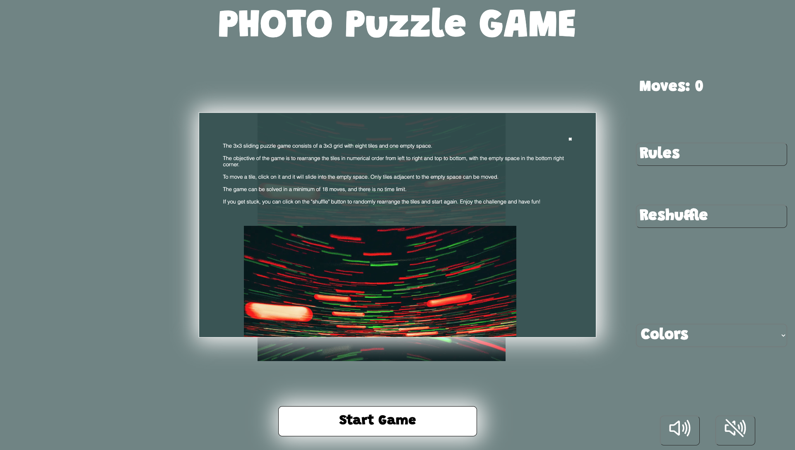

# Photo Puzzle Game

The Photo Puzzle Game is a JavaScript game that challenges players to complete a photo puzzle using their mouse or touch screen. Players can choose from a variety of puzzle images, with the ability to listen to music while playing.

You can challenge yourself with the puzzle --> [here](https://simonpaske.github.io/photo-puzzle-game)

---

## Sitewide

* By selecting an image to play, the example photo will pop up before starting the game.

* Feedback to a user when the puzzle is finished.

* Music while playing
  * A player can choose to play music while solving the puzzle.

* Favicon
  * Favicon with my logo is visible throughout the website pages.
  * It will help users faster and easier find my pages if many tabs in a browser are opened.

* 404 Page
  * The page will be displayed if a user navigates to a broken link.
  * 404 page allows users back to the game page by clicking on the logo.

---

### Home page

The home page loads blank with all the buttons.

* Dropdown option
  * Select wishful images for the puzzle game.

* Music buttons
  * Players can play and stop the music while playing.

* Reshuffle button
  * It allows players to reshuffle the puzzle if they can't succeed.

* Move counter
  * Players can follow their move count and try to improve at the game.

* Rules button
  * Players can read the rules of the game.
  * Gamers can check the example image if they got stuck and can't finish the puzzle.

* Start button
The button is on the home page. The user can start the game immediately by clicking the Start Game button. By default, the Triangle will be the first image of the puzzle.

* Puzzle rules
  * Rules and example image is accessible by clicking on Rules button.
  * The example image is changing regarding the selected puzzle.

---

### Game rules

The 3x3 sliding puzzle game consists of a 3x3 grid with eight tiles and one empty space.

The objective of the game is to rearrange the tiles in numerical order from left to right and top to bottom, with the empty space in the bottom right corner.

To move a tile, click on it and it will slide into the empty space. Only tiles adjacent to the empty space can be moved.

The game can be solved in a minimum of 18 moves, and there is no time limit.

---

### Features left to implement

* Add Score system table.
  * For example, scores would be counted like this: Time x Move count = Score.
  * Option for game sounds when clicking on the buttons and tiles.
  * Animation for moving tiles.
  * Advanced levels with more tiles.

---

### Wireframes

* Home page on load

* Home page when puzzle photo is selected

* Modal box with the rules and example image

* Feedback to player

* 404 Page

---

### Technologies

* HTML
  * The Website structure was developed using HTML as the main language
* CSS
  * For Website styling was used CSS in an external file
* Javascript
  * The game play logic was created using Javascript in an external file.
* Visual Studio Code
  * The website was developed using Visual Studio Code Desktop version using SSH key
* GitHub
  * Source code is hosted on GitHub and deployed using Git Pages
* Git Easy (extension for Visual Studio Code)
  * Was used to commit and push the code during the development process.
* Visual Studio Code Remote - SSH (extension for Visual Studio Code)
  * Was used to safely connect to the code stored on GitHub
* Git Graph (extension for Visual Studio Code)
  * Was used to follow the history of commits and correction comparison
* HTML Preview (extension for Visual Studio Code)
  * Was used to preview HTML files while editing them in VSCode
* Prettier - Code formatter
  * Was used to format code and keep it consistent
* W3C Web Validator (extension for Visual Studio Code)
  * Was used to check if any issues are detected and correct them
* Favicon.io
  * Favicon files were created at the favicon [converter](https://favicon.io/favicon-converter/)
* Adobe Photoshop
  * Was used to convert photos to low-size images
  * Was used to slice the image to small squares
* Justinmind
  * Was used to create wireframes
* Ionicons
  * Was used to make the website more attractive
* Google Fonts
  * Was used to keep text styling consistent

---

## Testing

### Responsiveness

---

All pages were tested to ensure responsiveness for screens from 300px up to 5000px. Responsive design was tested on Safari, Chrome and Firefox internet browsers.

Steps for testing:

1. Open the browser and enter the website [address](https://simonpaske.github.io/photo-puzzle-game)
2. Open developer tools by clicking the right button on the mouse or choosing the internet browser navigation bar.
3. Safari and Firefox browsers choose device type and size to see responsiveness. At Chrome internet browser by changing window size.

Expected:

No overlapping.
No strecthed or pixelated images.

Actual:
The website behaves as expected except on the 404.html page at landscape orientation on smaller devices. (Details can be found in the Unifixed bugs part of the documentation).

 

**The website was tested on these devices:**

Samsung S9

Samsung S22 Ultra

Samsung Note 9

Samsung S10e

iPhone SE

---

### Accessibility

For the final testing, I used [WAVE tool](https://wave.webaim.org/) to check aid accessibility.

Testing was focused to meet the following criteria:

* All images and non-text elements have aria-labels and alt text and it is implemented correctly
* Pages meet contrast levels
* All not textual content had alternative text or titles
* Aria properties have been implemented correctly

---

### Issues

The game has a bug. It is possible to cheat in the game if squares are in this sequence. Unfortunately, I could not fix it.

C - tile
0 - empty tile

X X 0
C X X
X X X

X X X
X X 0
C X X

X X X
X X C
0 X X

X X C
0 X X
X X X

---

**Game play**

The game goal is to reconstruct a scrambled image by swapping its different pieces in the correct position.

When you first load the game, you will be presented with a randomized puzzle image. The puzzle consists of several 8 pieces of the original image that are shuffled and rearranged randomly.

The game provides several tools to help you complete the puzzle. You can use the "Rules" button to display the original image, which can help you figure out the correct positioning of the pieces.

The game keeps track of the movements you take to complete the puzzle, so you can challenge yourself to finish the game with as less movements as possible. Once you have completed the puzzle, you will be rewarded with a congratulatory message and the option to start a new puzzle.

Overall, the game is a fun and challenging way to test your visual and spatial skills, as well as your patience and perseverance.

---
