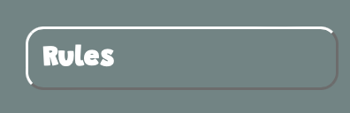

# Photo Puzzle Game

The Photo Puzzle Game is a JavaScript game that challenges players to complete a photo puzzle using their mouse or touch screen. Players can choose from a variety of puzzle images, with the ability to listen to music while playing.

You can challenge yourself with the puzzle --> [here](https://simonpaske.github.io/photo-puzzle-game)

---

## Sitewide

* By selecting an image to play, the example photo will pop up before starting the game.

* Feedback to a user when the puzzle is finished.

* Music while playing
  * A player can choose to play music while solving the puzzle.

* Favicon
  * Favicon with my logo is visible throughout the website pages.
  * It will help users faster and easier find my pages if many tabs in a browser are opened.

* 404 Page
  * The page will be displayed if a user navigates to a broken link.
  * 404 page allows users back to the game page by clicking on the logo.

---

## Home page

The home page loads blank with all the buttons.

* Dropdown option
  * Select wishful images for the puzzle game.

* Music buttons
  * Players can play and stop the music while playing.

* Reshuffle button
  * It allows players to reshuffle the puzzle if they can't succeed.

* Move counter
  * Players can follow their move count and try to improve at the game.

* Rules button
  * Players can read the rules of the game.
  * Gamers can check the example image if they got stuck and can't finish the puzzle.

* Start button
The button is on the home page. The user can start the game immediately by clicking the Start Game button. By default, the Triangle will be the first image of the puzzle.

* Puzzle rules
  * Rules and example image is accessible by clicking on Rules button.
  * The example image is changing regarding the selected puzzle.

---

## Game rules

The 3x3 sliding puzzle game consists of a 3x3 grid with eight tiles and one empty space.

The objective of the game is to rearrange the tiles in numerical order from left to right and top to bottom, with the empty space in the bottom right corner.

(One bug was found. More in the Bugs section.)

To move a tile, click on it and it will slide into the empty space. Only tiles adjacent to the empty space can be moved.

The game can be solved in a minimum of 18 moves, and there is no time limit.

### Features left to implement

* Add Score system table.
  * For example, scores would be counted like this: Time x Move count = Score.
  * Option for game sounds when clicking on the buttons and tiles.
  * Animation for moving tiles.
  * Advanced levels with more tiles.

## Wireframes

